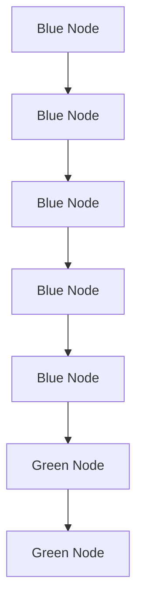

author: @alpha(wangyongsheng23@mails.ucas.ac.cn)

@asphr(zhuzhenyan23@mails.ucas.ac.cn)

copyright 2026 UCAS-SAS  All Rights Reserved

文中使用的第三方素材版权归原作者所有

# ⽬录

# Git 基础教程

0. ⾸先, git 是什么？

0.1 版本控制的需求  
0.2 团队协作的需求  
0.3 git 如何解决这些问题？  
0.4 ⚠️ 开始正式学习 git 操作前，⼀些说明

?? 1. 代码仓库

2. 配置git

3. git 基本操作

3.1 把远程仓库克隆到本地  
3.2 在本地仓库上进⾏暂存与提交  
3.2.1 如何正确 Commit  
3.2.2 ✍️ Commit Message 怎么写

3.3 ?? 拉取与推送

3.4 ?? 分⽀操作

3.4.1 创建和切换分⽀  
3.4.2 合并分⽀  
3.4.3 Pull Request（PR）

3.5 其他命令

# 0. ⾸先, git 是什么？

在既往的培训和实际⼯作中我们发现，很多成员并不清楚为什么要使⽤ Git，因此也很难理解像commit 信息应该怎么写、为什么要先建分⽀再提交这类规则。所以在了解 Git 的具体⽤法之前，我们希望先让你真正理解：为什么我们的⼯作需要使⽤ Git

说⼈话的话，git 就是⼀个给写代码的⼈/团队⽤的⼯具，以实现开发过程中 版本控制 和 多⼈协作的需要

# 0.1 版本控制的需求

接下来我们先⽤⼤家熟悉的 word 举例，对于代码，以下的需求也是⼀样存在的

你⽤ word 写⽂档时，可能会有这样的经历：

想删除⼀个段落，⼜怕未来想恢复找不回来？那就先把当前⽂件“另存为”⼀个备份的 word ⽂档，再接着改。改到⼀定程度，再“另存”⼀版⽂件，这样⼀直改下去，最后你的 word ⽂档变成了这样：

<table><tr><td>名称</td><td>修改日期</td><td>类型</td><td>大小</td></tr><tr><td>SAS战队汇报稿(初稿)</td><td>2026/4/27 14:30</td><td>Microsoft Word 文档</td><td>20 KB</td></tr><tr><td>SAS战队汇报稿(初稿改 第1版)</td><td>2026/4/27 14:30</td><td>Microsoft Word 文档</td><td>15 KB</td></tr><tr><td>SAS战队汇报稿(初稿改 第2版)</td><td>2026/4/27 14:41</td><td>Microsoft Word 文档</td><td>15 KB</td></tr><tr><td>SAS战队汇报稿(初稿改 第3版)</td><td>2026/4/27 14:41</td><td>Microsoft Word 文档</td><td>15 KB</td></tr><tr><td>SAS战队汇报稿(定稿)</td><td>2026/4/27 14:41</td><td>Microsoft Word 文档</td><td>15 KB</td></tr></table>

过了⼀段时间，你想找回删除的段落，却已经记不清删除前保存在第⼏版⽂件⾥，只好⼀个⼀个⽂件去找，⿇烦 （对⽐和查看新旧代码）

看着⼀堆乱七⼋糟的⽂件，想保留最新的⼀个，然后把其他的删掉，⼜怕哪天会⽤上，还不敢删，，，（备份⽂件、需要能够回溯过去的版本）

甚⾄，如果你要迭代⼏⼗⼏百版⽂件（这在⼀个项⽬开发中是很常⻅的），那你的⽂件夹会变成：第 1版、第 2 版...第 105 版...

# 0.2 团队协作的需求

现在你的 word ⽂档有些部分需要同队的同学帮忙写⼀些段落，然后你把⽂档通过微信/qq 发给对⽅，同时你⾃⼰也在继续修改⽂件。对⽅改完之后，再发回给你，这时候你必须查看，在你发给对⽅到对⽅发回⽂件期间，你做了什么更改，对⽅⼜做了什么更改，然后你要把两边的更改⼿动合并，是不是很⿇烦？（⾃动整合团队的更新内容）

# 0.3 git 如何解决这些问题？

那如果有⼀个软件能⾃动记录每次代码⽂件的更改，还可以让同伴协作编辑，这样就不⽤⾃⼰⼿动管理⼀堆相似的⽂件了，也不需要把代码通过 qq 在队⾥传来传去。假如你想了解新版和旧版具体改了哪些地⽅，⼀眼就可以看到

这个软件⽤起来应该是这样的：

<table><tr><td>版本</td><td>修改的文件</td><td>用户</td><td>说明</td><td>日期</td></tr><tr><td>1</td><td>SAS战队汇报稿.docx</td><td>alpha</td><td>修改文案中语句不通顺的地方</td><td>4/26 9:32</td></tr><tr><td>2</td><td>SAS战队汇报稿.docx</td><td>alpha</td><td>新增“战队未来目标”小节</td><td>4/26 10:11</td></tr><tr><td>3</td><td>SAS战队汇报稿.docx</td><td>asphr</td><td>补充了电控方面的一些具体技术细节</td><td>4/26 14:31</td></tr><tr><td>4</td><td>SAS战队汇报稿.docx</td><td>alpha</td><td>调整文段格式,形成终稿</td><td>4/26 16:20</td></tr></table>

它这样记录了项⽬⽂件内容的各个版本，以及每版代码是谁修改的。这样可以随时记录、查看或回退到任何版本

那实际 git 的使⽤效果是这样的：


fix(arm):机械臂电机命令发送和重新使能逻辑修正


keil重新配置，已过编


feat: keil配置new

如果要查看某⼀版⽂件具体改了什么：

<table><tr><td>源代码管理</td><td colspan="3">C arm_task.h (9270d8b) ← arm_task.h (8f35bf1) ×</td></tr><tr><td>存储库
electric-control-miner-co... SASML 00287e0a</td><td colspan="3">D: &gt; WYS files &gt; Operation &gt; RM_2026 &gt; electric-control-miner-code &gt; SAS_Code &gt; C arm_task.h</td></tr><tr><td>更改
electric-control-miner-co... 消息(Ctrl+Enter 在&quot;master&quot;提交)</td><td colspan="3">114 #define ARM_R4 66.0f
115 #define ARM_R5 103.25f
116 #define ARM_H 17.3f
117
118 #define TRANSLATION_DELTA_MAX_RC 0.2f // 在2ms内最大
119 #define ORIENTATION_DELTA_MAX_RC 0.08f // 在2ms内最大
120 #define HINGE_ARM_SPD_MAX_RC 20.0f
121 #define TRANSLATION_RC_SEN (TRANSLATION_DELTA_MAX_RC
122 #define ORIENTATION_RC_SEN (ORIENTATION_DELTA_MAX_RC
123 #define HINGE_ARM_RC_SEN (HINGE_ARM_SPD_MAX_RC / RC_C
124
125- #define TRANSLATION_DELTA_MAX_KEY 0.5f // 在2ms内最大
126- #define ORIENTATION_DELTA_MAX_KEY 0.01f // 在2ms内最大
127 #define PRESS_LONG_TIME 1000 // 长时间保持
128 #define GRIPPER_LONG_PRESS_TICKS (GRIPPER_LONG_PRESS_
129 #define LASER_CTRL_TIME ARM_TASK_CTRL_TIME
130
131 #define HINGE_ARM_DELTA_MAX_KEY 500.0f // 在5ms内最大
132
133 #define MAP_PARA 1.0 // 暂无用
134 #define MOTOR_1_MAX_LIMIT_ANGLE (0.52 * MAP_PARA)
135 #define MOTOR_1_MIN_LIMIT_ANGLE (-0.77 * MAP_PARA)
136 #define MOTOR_2_MAX_LIMIT_ANGLE (0.06 * MAP_PARA)
137 #define MOTOR_2_MIN_LIMIT_ANGLE (-1.8 * MAP_PARA)
138 #define MOTOR_3_MAX_LIMIT_ANGLE (2.65 * MAP_PARA)
139 #define MOTOR_3_MIN_LIMIT_ANGLE (-2.2 * MAP_PARA)
140 #define MOTOR_4_MAX_LIMIT_ANGLE (2.65 * MAP_PARA)
141 #define MOTOR_4_MIN_LIMIT_ANGLE (-1.68 * MAP_PARA)
142 #define MOTOR_5_MAX_LIMIT_ANGLE (0.96 * MAP_PARA)
143 #define MOTOR_5_MIN_LIMIT_ANGLE (-3.85 * MAP_PARA)
144 #define MOTOR_6_MAX_LIMIT_ANGLE (3.43 * MAP_PARA)
145 #define MOTOR_6_MIN_LIMIT_ANGLE (-0.36 * MAP_PARA)
146
147 #define SUCTION_MAX_X 1000.0f
148 #define SUCTION_MIN_X -1000.0f</td></tr><tr><td>GITLENS</td><td></td><td></td><td></td></tr></table>

（上图左侧栏可以看到每⼀版代码改了那些⽂件。点击可以打开查看⽂件具体改动的地⽅，打开的视图是新旧版本的对⽐，左边是旧版，右边是新版，红⾊标出删除的⾏，绿⾊标出新加的⾏，通过这种⽅式表⽰更改）

# 0.4 ⚠️ 开始正式学习 git 操作前，⼀些说明

在代码的修改与维护中，由于上传代码不够规范或者操作不当，可能引起⼀系列差错。因此需要熟练掌握 git 的基本操作，并严格遵守队⾥上传代码的规范

本篇教程相对简单，⽬的是帮助你快速上⼿git参与我们的开发。git还有更多进阶操作，感兴趣的话可⾃⾏搜索教程学习，或在⽇后的开发中慢慢了解

在开始之前，请确认你的电脑已安装了git: 终端输⼊ git --version ，回⻋可以查看 git 的版本，如果输出版本号就没问题。如果没有（终端提⽰： git: command not found ），⽹上有很多安装教程，⽐如官⽅教程here

安装路径请不要包含中⽂，如果你的电脑是中⽂⽤⼾名（⽐如华为电脑、或⾃⼰不⼩⼼改成中⽂⽤⼾名），你的 git 使⽤可能会不正常，请联系⽼队员或⾃⾏查询解决办法

此外，也请先下载安装好vscode，⽅便后续开发

vscode 是功能⾮常强⼤的代码编辑器

⾸先你需要了解代码仓库的概念：

代码仓库（Repository）：实际上就是你的项⽬⽂件夹，存放了你的代码⽂件

为了避免遇到奇怪的问题，请尽量确保⽂件夹路径中不含中⽂

本地仓库：项⽬⽂件夹是存在你⾃⼰的电脑上（即存在本地），就叫本地仓库

需要注意的是，⼀般来说本地仓库中还会有⼀个隐藏⽂件夹 .git ，这个⽬录称为版本库，包含了仓库的配置⽂件、版本控制信息等必要信息，vscode 根据⾥边的内容加载 git ，开发的时候可以⽆视，但是别动别删别改

<table><tr><td>名称</td><td>修改日期</td><td>类型</td><td>大小</td></tr><tr><td>.git</td><td>2026/3/27 7:17</td><td>文件夹</td><td></td></tr><tr><td>.vscode</td><td>2026/2/7 22:28</td><td>文件夹</td><td></td></tr><tr><td>application</td><td>2026/2/7 22:28</td><td>文件夹</td><td></td></tr><tr><td>bsp</td><td>2026/2/7 22:28</td><td>文件夹</td><td></td></tr><tr><td>components</td><td>2026/2/7 22:28</td><td>文件夹</td><td></td></tr><tr><td>configure</td><td>2026/2/7 22:28</td><td>文件夹</td><td></td></tr><tr><td>docs</td><td>2026/3/6 15:30</td><td>文件夹</td><td></td></tr><tr><td>Drivers</td><td>2026/2/7 22:28</td><td>文件夹</td><td></td></tr></table>

远程仓库：既然要统⼀管理代码，那就需要把你本地的代码⽂件夹放到互联⽹上，供每个成员访问，这个仓库就是远程仓库，成员可以直接在⽹上点击浏览或者下载远程仓库⾥的⽂件。有很多⽹站提供远程仓库服务，如 GitHub ，Gitee 等，我们战队使⽤的就是 Gitee。下图为我们的⼀个远程仓库界⾯：


<details>
<summary>text_image</summary>

gitee 开源 企业版 高校版 私有云 模力方舟 AI 队友 我的
UCAS-SAS-Robot-Team/电控组工程机器人代码
↓ 代码 Issues 1 Pull Requests 0 Wiki 统计 流水线 服务 管理
你当前开源项目尚未选择许可证（LICENSE），点此选择并创建开源许可
master 分支 2 标签 1 克隆/下载
Alpha. perf: 修正 c5e5f55 1个月前 187 次提交
SASML @ 00287e0 feat: 中间件库更新 2个月前
.vscode feat(arm): 增加机械臂电机使能函数can返回状态观察，微改循环初始化逻辑 5个月前
Drivers feat: cubemx 重生成，更改图传链路波特率，以兼容新的赛事通讯协议 2个月前
Inc feat: cubemx 重生成，更改图传链路波特率，以兼容新的赛事通讯协议 2个月前
MDK-ARM perf, feat: 官方遥控器夹爪开闭逻辑调整，底盘速度调整，底盘运动控制参数调整；新增自定义... 1个月前
Middlewares refactor: 移除自定义控制器等部分代码，只保留机器人代码 3个月前
SAS_Code perf: 修正 1个月前
Src fix: 注释乱码恢复，usart_communicate 文件中函数名修改以提升语义清晰度，关闭不用的 OLE... 2个月前
application feat: 键鼠信号接收逻辑由图传链路 0x0304 命令帧解析改用图传接收端开放的键鼠，以适配官... 1个月前
bsp/boards refactor: 移除自定义控制器等部分代码，只保留机器人代码 3个月前
components refactor: 移除自定义控制器等部分代码，只保留机器人代码 3个月前
configure refactor: 移除自定义控制器等部分代码，只保留机器人代码 3个月前
docs feat: 机械臂控制信号逻辑更新 2个月前
.clang-format style: else换行 3个月前
.gitignore Merge branch 'master' of https://gitee.com/ucas-sas-robot-team/electri... 5个月前
简介
SAS工程机器人电控代码
暂无标签
README
Stars
Watching
Forks
发行版
暂无发行版，创建
贡献者 (5)
A M
语言
C 98.2% C++ 1.4%
Motorola 68K Assembly 0.4%
近期动态
14天前创建了任务 #U8NSO 代码整理，官遥控制逻辑不变更但要将状态机更变为符合语义的命名，其他在赛场上的临时 perf 更改要整理，其他逻辑和格式可暂不变更（工程机器人结构可能要大改
</details>

# 注意，git 和 gitee 是不同东西：

Git 是运⾏在你本地电脑上的版本控制软件

Gitee 是⼀个⽹站，提供远程仓库的托管服务。你可以把 git 的代码上传到 gitee ⽹站，就像你可以把⽂件上传到⽹盘⼀样。GitHub 是另⼀个类似的⽹站，作⽤是⼀样的。

# 2. 配置git

请跟着本部分的介绍进⾏操作，在你⾃⼰的电脑上完成 git 配置

我们战队使⽤ Gitee 托管我们的远程仓库，所以⾸先请在gitee官⽹先注册好账号

在电脑终端中⼀次执⾏如下操作，完成git配置。在name和email处填⼊⾃⼰在gitee注册时使⽤的⽤⼾名和邮箱

为确保你提交的代码身份被Gitee正确识别，请执行以下命令完成配置  
```txt
git config --global user.name 'asphr'
git config --global user.email 'zsyh726@gmail.com' 
```


初次使用 SSH协议进行代码克隆、推送等操作时，需按下述提示完成 SSH 配置  
1生成 RSA 密钥  
```txt
ssh-keygen -t rsa 
```


2 获取 RSA 公钥内容，并配置到 SSH公钥 中  
```batch
cat ~/.ssh/id_rsa.pub 
```


# 具体操作：

1. 打开终端，使⽤以下命令配置git：

```txt
git config --global user.name '引号内替换成你自己的用户名'
git config --global user.email '引号内替换成你自己的邮箱'
```

# 注意⽤⼾名和邮箱需要和Gitee注册时使⽤的⽤⼾名和邮箱⼀致，以便识别

这两条命令分别为本地 git 软件配置⽤⼾名和邮箱，这样你提交代码的时候就会带有你⾃⼰的⾝份信息

命令中 --global 的意思是这台电脑上所有⽤ git 的仓库都⽤这个配置，避免每个仓库都要额外配⼀遍

2. ⽣成 ssh 密钥配置到 Gitee

i. 打开终端，运⾏如下命令⽣成密钥

```txt
ssh-keygen -t rsa 
```

然后⼀直按回⻋( enter )到结束。

ii. ⽣成密钥后，运⾏如下命令打印出公钥

```batch
cat ~/.ssh/id_rsa.pub 
```

将输出的内容全部复制下来。

iii. 得到ssh密钥后，配置到gitee中: ⽹址


<details>
<summary>text_image</summary>

添加公钥
标题
公钥标题(key)
公钥
把你的公钥粘贴到这里，查看怎样生成公钥
支持以 'ssh-rsa', 'ssh-dss', 'ssh-ed25519', 'ecdsa-sha2-nistp256', 'ecdsa-sha2-nistp384' or 'ecdsa-sha2-nistp521' 开头
确定
</details>

将复制的内容粘贴到公钥栏内，标题栏取⼀个⾃⼰认得的名字即可。

点击确定完成配置

这⾥是在配置 ssh，这么做的原因后⽂会解释

# 3. git 基本操作

# 3.1 把远程仓库克隆到本地

clone 操作是什么？

简单说： 把远程仓库的所有⽂件和历史记录完整地复制到你的电脑上

具体来说，当你要开始参与⼀个项⽬时，需要先把 Gitee 上的项⽬（远程仓库）下载到本地。clone 就是这个下载的过程，它会把项⽬⽂件、版本历史等全部复制下来，⽽不只是最新的⽂件。这样你就有了完整的项⽬副本，可以在本地修改和开发

在终端使⽤ git clone 命令，将远程仓库克隆到本地：

// 命令格式：git clone + 仓库地址

git clone git@gitee.com:[仓库地址]

仓库⽂件将会克隆到终端当前⽂件夹下。

例如下图，按⽹⻚提⽰复制⽹⻚给出的命令到终端执⾏即可：

下载代码请复制以下命令到终端执行

git clone git@gitee.com:ucas-sas-robot-team/sas-gitee-use-trainning.git

【！注意】 点击 克隆/下载 按钮后，你会看到提供多种⽅式进⾏ clone：

HTTPS

SVN

SVN+SSH


```css
git@gitee.com:ucas-sas-robot-team/electric-control-miner-code.git 
```


# 提示

下载代码请复制以下命令到终端执行

```batch
git clone git@gitee.com:ucas-sas-robot-team/electric-control-miner-code.git 
```


第 3 个和第 4 个选项的 SVN 不⽤管（SVN 是和 git 类似的另⼀种版本管理软件），主要看第 1 个 http选项和 ssh 选项：

# http 和 ssh 两种⽅式是什么意思？

这是两种不同的⾝份验证⽅式，⽤来确认你有权访问远程仓库

HTTP ⽅式：每次你要操作远程仓库时，git 都会要求你输⼊ Gitee 的⽤⼾名和密码。好处：简单直接，⽆需提前配置。缺点：每次都要输密码，⿇烦  
SSH ⽅式：你提前⽣成了密钥对并配置到 Gitee（就是前⾯的 ssh 配置步骤），之后操作远程仓库时 git 会⾃动⽤密钥验证你的⾝份，不需要输密码。好处：省事⼉

我们战队使⽤ SSH ⽅式，所以进⾏ clone 时请选择 ssh

# 3.2 在本地仓库上进⾏暂存与提交

clone 完仓库，代码已经在你的电脑上了。现在你可以开始改代码了——但改完怎么保存？这就是commit

# commit 是什么？

简单来说，commit 就是 git ⾥的 ctrl + s 保存。说专业点，commit 是把当前的修改保存成⼀个版本记录，存到本地仓库⾥

打⽐⽅的话就是：打游戏的时候，到了⼀个关键节点会顺⼿存个档——万⼀后⾯操作失误了，还能读档回到这个安全点。git ⾥的 commit 就是这样的”存档”：每做⼀次 commit，git 就给当前代码拍⼀张快照。以后你可以随时查看、对⽐、甚⾄回退到任意⼀个 commit 时的状态

commit 是在本地进⾏的——你电脑上的修改，先 commit 到本地仓库，之后才能推送（push）到远程让队友看到

# 那暂存（add）⼜是什么？

commit 并不是⼀键把所有的修改都打包存进去。git 把它拆成了两步：

1. add（暂存）—— 挑出哪些修改是你这次想 commit 的  
2. commit（提交） 把挑好的修改正式存成⼀个版本

为什么要多这⼀步？因为有时候你改了好⼏个⽂件，但只想提交其中⼀部分；或者同⼀个⽂件⾥改了好⼏处，只想先把其中⼀处 commit 了。add 就是让你”挑好要存的东西”。挑完再 commit，那些你没add 的修改会留在⼯作区，不会进⼊本次提交

# 在 vscode 上进⾏ add 和 commit：

vscode 提供了 git 的图形化界⾯，通过点击按钮就可以进⾏ add 和 commit 操作


<details>
<summary>text_image</summary>

SOURCE CONTROL
CHANGES
Message (%Enter to commit on "...
✓ Commit
Changes
git-branch.png assets
git-clone.png assets
git-config.png assets
✓ git操作与规范.md git培训
</details>

改完代码后，git 会⾃动检查并显⽰有变动的⽂件（如上图），点 + 号暂存（add）单个⽂件的修改。如果所有的修改都需要⼀次 commit ，那可以点”全部暂存”（上边红圈的 + ）⼀把梭。然后在 Message输⼊框⾥写好本次修改的说明（很重要，后⽂会仔细讲），点击 Commit 就⾏了

通过命令⾏进⾏ add 和 commit：

git ⽀持通过命令⾏进⾏操作，但不如 vscode 的图形化界⾯操作直观。对于新⼿我们暂不推荐使⽤命令⾏，但这⾥也给出具体命令，感兴趣的话可以⾃⾏搜索进⼀步了解

git add <文件名> # 暂存某个文件

git add . # 暂存全部修改

git commit -m “你的提交说明”

# 3.2.1 如何正确 Commit

你已经了解了 commit 怎么操作，但“会⽤”并不等于“⽤得好”。⼀个好的 commit 能让 git log 像⼀本清晰的历史书，可以轻松回溯项⽬的演进历程；⽽不好的 commit 则像流⽔账，除了告诉你谁在写代码，⼏乎没有任何有效信息

⼀个规范的 commit 应该同时满⾜以下三点：有意义、完整、独⽴

✅ 有意义：⼀个 commit 必须真正完成了⼀件事情

⽽不是："写俩⼩时代码了，先存个档"、"改了很多⽂件了，先存个档" "去吃饭了，先存个档"、"下班了，存个档"

✓ 完整：commit 不能让项⽬坏掉

即⼀版 commit 不能是编译失败、或上机器⼈测试不过的（在开发时，有时候 commit 暂时⽆法上机验证，但⾄少应该先过编

?? 独⽴：⼀个 commit 应该只专注做⼀件事

⽐如不要在重构的 commit ⾥同时修 bug；在不要修 bug 的 commit ⾥偷偷加了新功能（如果你已经⼀次在不同⽂件同时做了重构和修 bug 操作，那就把重构的⽂件和修的 bug 分成两次commit 就好

# 3.2.2 ✍️ Commit Message 怎么写

commit message 是 commit 时写的说明，下图中每个 commit 的⽂字说明就是 commit message：


fix(arm):机械臂电机命令发送和重新使能逻辑修正


keil重新配置，已过编


feat: keil配置new

message 是给未来的⾃⼰（或队友）看的。好的 message 应该⼀眼就看明⽩：为什么要做这次提交，以及这次提交改了什么

设想⼀下，你翻到两个⽉前⼀个 message ，是这样写的：

“改了点东西”

“debug”

“feat”

这⻤知道改了什么。所以我们推荐按下⾯的格式来写，下⾯的三个部分中间⽤空⾏隔开：

// 标题行（必填）：用一句话把这次改了什么说清楚

<type类型>(<scope 可选作用域>): <subject 描述>

// 正文（选填）：展开说说为什么这样改、思路是什么

<body 可选的正文>

// 脚注（选填）：放个 BUG 链接、关闭的 Issue 编号之类的

<footer 可选的脚注>

# 直接看例⼦就是：

feat(gimbal): 增加云台角度限位保护

之前云台转到极限位置会卡死，加了一个角度检测，

超过 ±45° 就自动停止电机输出，防止堵转。

⼀般来说，只要写标题⾏就够了，如 feat(gimbal): 增加云台角度限位保护 ，正⽂和脚注只在需要详细解释的时候添加

# 你会发现，标题⾏也是有⼀定格式的：

type（必填）——说明这次 commit 属于什么类型，从下⾯这些⾥⾯挑：

feat ：新功能、新特性（feat 是 feature 的缩写）  
fix ：修 bug   
perf ：性能优化（⽐如调了调电机控制参数，优化可已经有的⼈机交互逻辑等等）  
refactor ：重构（不改变功能，只优化代码结构）  
docs ：改⽂档  
style ：代码格式变更（改空格、分号之类的，注意不是指 CSS）  
·以上是队里开发常用的，最好记住，以下是不那么常用的：

test ：测试相关的新增或修改  
build ：构建系统或依赖项的变更  
revert ：回退到之前的某次提交   
ci ：持续集成（CI）配置的修改  
chore ：杂项，不在上⾯这些类型⾥的  
release ：发布新版本  
workflow ：⼯作流配置

scope（选填）——作⽤域，说明这次 commit 影响的范围

⽐如给机械臂新增了功能，那就在 feat 后括个括号写 feat(arm): xxx  
scope 常填某个模块名、某个⽂件名。有时候也可以不填——⽐如改的是全局配置、或者修改范围⽐较散不好归纳，直接写 xxx: 新增/修改xxx 就⾏

subject（必填）——⼀句话概述，我们队⾥⽤中⽂写就⼻亍，不超过 50 个字符。写清楚解决了什么问题。

# 3.3 ?? 拉取与推送

commit 只是把修改存到了你的本地仓库。队友还看不到。要想让队友看到你的代码，就得把本地的commit 传到远程仓库；反过来，你也要拿到队友传到远程的 commit。这就需要 push 和 pull。

# push 是什么？pull ⼜是什么？

push（推送）：把你本地 commit 好的修改，上传到远程仓库。这样队友就能看到你的代码  
pull（拉取）：把远程仓库⾥别⼈新 push 的改动，下载到你的本地，并和你的本地代码合并

# vscode 图形化界⾯操作：

# 1. push

当你做完 commit 时，界⾯如下：


<details>
<summary>text_image</summary>

源代码管理
存储库
sas-gitee-use-training m... 0...
更改
消息(Ctrl+Enter 在"master"提交)
同步更改 1↑
图表
传出的更改 master
feat: 示例 commit 3 Alpha.
feat: 示例 commit 2 Alpha. origin/mas
feat: 这是一个示例 commit Alpha.
以树形式查看
查看和排序
拉取
推送
克隆
签出到...
抓取
Compose Commits (Preview)...
</details>

想要 push ，只需要点击图⽰的 3 个点 - 推送（英文版界面这个按钮是 push） 即可完成

这⾥额外解释下“图表”：这是 VS Code 中 Git 提交历史的可视化图表。图中蓝⾊点表⽰当前本地分⽀（如 master）的最新提交，紫⾊点表⽰远程分⽀（如 origin/master）的提交记录。

图中显⽰，蓝⾊点在紫⾊点之上，说明本地分⽀⽐远程分⽀领先（ahead），也就是本地还有提交尚未推送到远程仓库

# 2. pull


<details>
<summary>text_image</summary>

源代码管理
存储库
sas-gitee-use-training m... 1...
更改
消息(Ctrl+Enter 在"master"提交)
以树形式查看
查看和排序
拉取
推送
克隆
签出到...
抓取
图表
自动
● feat: 示例 commit 2 Alpha. origin/mas
○ 传入的更改 origin/master
● feat: 这是一个示例 commit Alpha. mas
● feat(physics):新增 User-04 WaterWalk505
Compose Commits (Preview)...
</details>

点击那 3 个点-拉取（英文版界面就是 pull） 就可以完成 pull 操作

# 3. 同步更改按钮的说明：

你会看到上图中有⼀个标了 同步更改 的按钮，图中 存储库 （绿⾊的那⼀栏）中有⼀个 循环箭头?? ，整个 vscode ⻚⾯左下⻆也有⼀个 循环箭头 ：


<details>
<summary>text_image</summary>

feat(physics):新增介绍
feat(physics):新增介绍
feat(example):增加 tem
6 WaterWalk505
feat(example):加了 7 v
feat(example):加了 6 v
> GITLENS
master 0↓1↑
</details>

这些按钮的功能是相同的：\*\*⼀键完成"先 pull 后 push"\*\*。点击之后，git 会先把远程的更新拉下来合并好，再把你本地的 commit 推上去。这个按钮在开发中很常⽤

# 为什么 push 前最好先 pull？

想象这个场景：你和队友都在改 main.cpp 。远程仓库上最新的 commit 是 A。你 clone 下来，基于 A改了⼀些代码，commit 了⼀个 B；队友也在差不多的时间，基于 A改了另⼀些代码，commit 了 C，然后队友先你⼀步 push 了

现在远程仓库的历史是 A → C ，⽽你本地的历史是 A → B 。这时候你 push，git 会发现：你本地的commit B 不知道 C 的存在，如果直接让你的 B 上去了，队友的 C 就可能被盖掉了—— git 不允许这种事发⽣，所以它会直接拒绝你的 push

所以在 push 之前，先 pull ⼀下——把队友的 C 拉到你本地，和你的 B 合并成 A → C → B （或者A → B → C ），确认没⽑病再 push。也就是：

```txt
pull → （如果提示有冲突就解决冲突）→ push
```

⼀个⼩提醒：不要改⼀⾏就 push ⼀次（太频繁）；也别把本地攒了⼀个星期的修改⼀次性 push（攒太久到后⾯合并冲突会⾮常头疼）。改完⼀个完整的功能点，commit 好了就可以 push。

# 对于 pull 和 push 操作，我们也推荐使⽤命令⾏：

git push [<远程仓库> <本地分支>[:<远程仓库分支>]]

git pull [<远程仓库> <远程仓库分支>[:<本地分支>]]

其中 origin 指远程仓库， master 指主分⽀（有些仓库主分⽀可能叫 main ）。⽐如：

git push origin master

\# 把本地的 master 分支推送到远程

git pull origin master

\# 把远程的 master 分支拉下来并合并到本地

# 3.4 ?? 分⽀操作

前⾯说的 commit、push、pull 都是在同⼀条”线”上操作。但如果很多⼈同时在改同⼀个项⽬的不同功能，都往同⼀条线上 commit，场⾯会⾮常混乱——你改到⼀半的代码可能会让队友的项⽬跑不起来，队友的修改也可能把你的代码覆盖掉。

这就是分⽀（branch）要解决的问题——为较⼤规模的尝试性修改建⽴新分⽀，对修改结果满意后再合并到主分⽀，⽽且在⽐ commit 更⼤的粒度上管理代码的修改记录


<details>
<summary>flowchart</summary>


</details>

# 分⽀是什么？

分⽀是从主线上分出来的"平⾏线"，你在这条线上怎么改都⾏，不会影响主线的代码。

仓库⾥有⼀个主分⽀，叫 master （或 main ），它上⾯放的是最稳定、能正常跑的代码。当你要开发⼀个新功能——⽐如“给底盘加⼀个功率限制功能”——你最好不要直接在 master 上改。因为你写到⼀半的代码⼤概率是有 bug 的，如果这时候队友 clone 了 master，整个⻋可能都跑不起来

正确做法是：从 master 分出⼀条新分⽀，起个名⽐如 chassis-auto-brake ，在这条分⽀上随便怎么改、怎么 commit 都⽆所谓，master 纹丝不动。等你写完、测完、确认没问题了，再把这条分⽀合并回 master

还有⼀种情况是，我们仓库的 master 分⽀有保护，普通仓库成员没有直接向 master 分⽀ push代码的权限。这时需要先 push 到别的分⽀，再向仓库管理员申请 merge 到 master（提⼀个pull request ）

# 3.4.1 创建和切换分⽀

终端输⼊以下命令（vscode 图形化操作⼊⼝⻅下⽂）：

```txt
git branch # 看看本地有哪些分支（当前分支前面有 * 号）
git branch <新分支名> # 创建一个新分支
git checkout <分支名> # 切换到某条分支
git checkout -b <新分支名> # 创建新分支并直接切过去（最常用）
```

⽐如接到⼀个新任务，正常操作就是：

```txt
git checkout -b chassis-auto-brake # 创建并切换到新分支
# ... 改代码 ... commit ... 
```

# 3.4.2 合并分⽀

分⽀上的活⼲完了，就该把它合回 master：

git checkout master

\# 先切回 master

git merge chassis-auto-brake

\# 把 chassis-auto-brake 合到 master

如果合并时，两个⼈改了同⼀个⽂件的同⼀⾏代码，git 就不知道该留谁的，这就是冲突（conflict）。不⽤慌，vscode ⾥解决冲突很直观——它会并排显⽰两边的修改，你点⼀下就能选保留哪⼀边。

vscode 图形界⾯的操作：  


<details>
<summary>text_image</summary>

CHANGE
Message (Enter to commit on "...
✓ Commit
✓ Changes
git-clone.png assets
git-config.png assets
✓ git操作与规范.md git培训
View & Sort >
Pull
Push
Clone
Checkout to...
Fetch
Commit >
Changes >
Pull, Push >
Branch >
Remote >
Stash >
Tags >
Show Git Output
Merge...
Rebase Branch...
Create Branch...
Create Branch From...
Rename Branch...
Delete Branch...
Delete Remote Branch...
Publish Branch...
</details>

⻚⾯左下⻆也能切换分⽀、创建分⽀  


<details>
<summary>text_image</summary>

× master*
</details>

#

#

十 创建新分支依据..

$\mathfrak { S } ^ { \mathbb { S } }$ 签出已分离...

$8 9$

origin/master 2周前

说明：在我们开发时，有些仓库⾥可能只有 1-3 个活跃成员，因此⼤部分新功能也不会专⻔⽤分⽀管理，成员都可以直接在 master 上提交（⼈少简化流程）。实际加⼊仓库开发时，请先向管理员确认该仓库的协作⽅式

# 3.4.3 Pull Request（PR）

你已经了解，新功能开发⼀般需要在分⽀上进⾏，完成后合并回 master。但合并并不是直接git merge 就完事——在多⼈团队中，你的代码需要经过仓库管理员\*\*审查（review）\*\*才能合⼊主分⽀。Pull Request 就是⽤来做这件事的。

# Pull Request 是什么？

Pull Request（简称 PR）是⼀个请求：请求仓库管理员把你分⽀上的修改"拉取"到主分⽀。

名字有点反直觉——它不是你主动 pull 什么，⽽是你发起⼀个请求，希望别⼈来 pull 你的代码。

打个⽐⽅：你写了⼀份报告，提交给组⻓审核——你说"我的部分写好了，你看看⾏不⾏，⾏的话就加到终稿⾥"。组⻓看完可以批注修改意⻅，你改完再提交，反复直到没问题了，组⻓签字通过，你的内容正式合并到终稿。

# PR 在团队开发中的流程

假设你要给底盘加⼀个急停功能，完整流程是：

1. 从 master 分出⼀条新分⽀ chassis-auto-brake  
2. 在这条分⽀上改代码、commit、push 到远程的这个分⽀（不是直接 push 到 master）  
3. 在 Gitee 上发起⼀个 Pull Request，请求把 chassis-auto-brake 合⼊ master  
4. 队⻓或其他队员来 review 你的代码——他们会逐⾏看你的改动，在有问题的地⽅写评论（⼀般没什么问题这⼀步会直接通过）  
5. 你根据 review 意⻅修改代码，在同⼀分⽀上继续 commit、push，PR 会⾃动更新  
6. review 通过后，审核⼈点击合并按钮，你的代码就正式进⼊ master 了

这⾥的关键区别是： merge 是在本地进⾏（直接 git merge ），⽽ PR 是在远程仓库平台上发起、经过⼈⼯审批后再合并 。PR 相当于在 merge 之前加了⼀道审查流程

# 操作⽅法

pr 操作在 gitee 的 分支 ⻚⾯进⾏，点击 创建 Pull Request 按钮即可开始向 master 进⾏ pr

非活跃分支

asphr 更新于7个月前

向默认分支创建 Pull Reauest

创建 Pull Request

我们战队的某些仓库中，master 分⽀设置了保护，⾮管理员没有直接 push 到 master 的权限。此时你就需要：

建新分⽀ → push 到新分⽀ → 提 PR → 等 review 通过

这是参与开发的必经流程

# 3.5 其他命令

这些暂时⽤不上也没关系，知道有就⾏，以后遇到具体场景再回来查：

```shell
git log # 查看过往的 commit 记录，找到你想回退到的那个版本的 hash 值
git reset --soft <hash> # 回退到指定版本，但在暂存区保留更改
git reset --hard <hash> # 回退到指定版本并丢弃更改（操作不可逆，谨慎使用）
```

更多命令按需⽹上搜，⼏乎所有 git 操作都能搜到答案。更快的⽅法是直接问 AI（doge

推荐⼀个好的教程：

菜⻦教程 | git 教程

⼀个可以练习 git 分⽀操作的⼩⽹站：

learn git branching