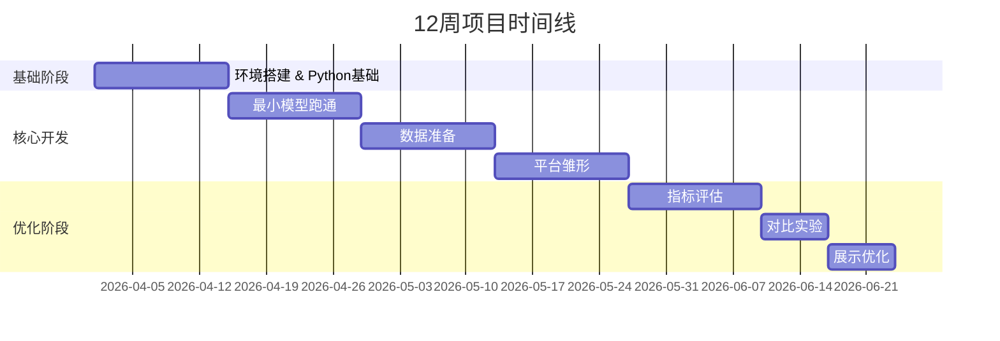

# UCAS LLP - 小语言模型平台

[](LICENSE)
[](https://www.python.org/)
[]()

> 中国科学院大学（UCAS）小语言模型（Small LLM）研究项目 - 从零构建可运行的文本生成与评估平台

---

# 项目简介

  本项目旨在构建一个完整的小语言模型平台，支持模型推理、微调、评估和可视化展示。通过12周的系统学习与实践，团队将掌握从数据准备到前后端部署的全流程开发技能。

## 核心功能

- 文本生成：基于distilgpt2/TinyLLaMA/gemma4等轻量级模型的本地推理
- 参数调节：支持 temperature、max_length等生成参数实时调整
- 模型微调：基于LoRA技术的高效参数微调
- 效果评估：BLEU 评分、困惑度（PPL）计算与可视化
- 交互界面：Streamlit前端 + Flask/FastAPI后端
- 实验记录：完整的实验数据保存与对比分析

## 团队架构

| 组别 | 人数 | 核心职责 | 技术栈 |
|------|------|----------|--------|
| **模型组** | 2人 | 小语言模型下载、推理、本地微调 | Transformers, PyTorch, PEFT |
| **数据组** | 2人 | 数据收集、清洗、测试集构建 | Pandas, JSON, Regex |
| **评估组** | 2人 | BLEU、PPL 实现与实验对比 | NLTK, evaluate, matplotlib |
| **前端组** | 2人 | 平台页面设计、输入输出界面 | Streamlit, Gradio |
| **后端组** | 2人 | API 接口、前后端连接 | Flask, FastAPI |
| **文档测试组** | 1人 | 文档整理、实验测试、PPT 制作 | Markdown, Obsidian |

---

## 项目路线图



| 周次 | 阶段 | 主要任务 | 目标产出 |
|------|------|----------|----------|
| 第 1-2 周 | 基础学习 | Python、Git、AI 基础概念 | 所有人理解项目整体流程 |
| 第 3-4 周 | 最小模型跑通 | 下载小模型、本地生成文本 | 完成第一个 Demo |
| 第 5-6 周 | 数据准备 | 清洗文本、构建测试集 | 可供实验的数据集 |
| 第 7-8 周 | 平台雏形 | 前后端连接、模型接入页面 | 可输入文本得到输出 |
| 第 9-10 周 | 指标评估 | BLEU/PPL 计算与可视化 | 能展示实验指标和对比结果 |
| 第 11 周 | 对比实验 | 不同参数/Prompt/微调策略实验 | 得到可展示实验结论 |
| 第 12 周 | 展示优化 | 界面美化、PPT 制作、答辩演示 | 完整科创展示版 |

---

# 仓库结构

* UCAS_LLP/    
	* backend/ # 后端（接口层）  
		* app.py/ # API入口  
		* model_api.py/ # 模型调用  
		* experiment.py/ # 实验逻辑 
		* config.py/ # 配置（模型名、参数等）   
	* frontend/ # 前端（界面层）  
		* app.py/ # Streamlit主程序
		* components/ # UI组件
	* evaluation/ # 评估模块  
		* bleu.py  
		* ppl.py  
		* metrics.py
		* visualize.py/ # 画图
	* data/ # 数据
		* raw/ # 原始数据
		* processed/ # 处理后数据
		* test_cases.json/ # 测试输入
		* results/ # 实验结果（JSON/CSV）  
	* models/ # 模型配置（不放模型本体）  
		* model_config.json/
	* scripts/ # 自动化脚本
		* run_experiments.py/ # 一键跑实验
		* generate_plots.py/ # 自动画图
	* tests/ # 测试
		* test_model_api.py 
	* LLP_Docs/ # 文档 
		* README/ # 规范文档
			* Engineering&DEV/ # 工程与开发文档
				* Changelog.md/ # 更新日志
				* Resource_Center.md/ # 资源池
				* Module_Docs/ # 模块文档
					* API_Spec.md/ # API规范
					* Data_Standard.md/ # 数据标准
					* Inference_Guide.md/ # 推理指南
			   * Project_Govern/ # 项目管理
				* README.md/ # 团队分工总表
				* PLAN.md/ # 12周详细计划
				* Setup.md/ # 环境配置指南
				* TEAMS.md/ # 团队信息
		       * Results & Analysis/ # 结果与分析
				* Evaluation.md/ # 评估报告
				* Experiment_Log.md/ # 实验日志
		* Weekly_Reports/ # 周会记录 
		* README.md
		* .gitignore
	* .gitignore
	* requirements.txt/ # 依赖  
	* run.sh/ # 一键启动
	* README.md/ # 本文件

---

# 快速开始

## 环境要求

- Python 3.8+
- Git
- 稳定的海外网络访问（用于 Hugging Face）
- Gmail 账号（用于 Hugging Face 登录）

## 安装步骤

1. **克隆仓库**
   ```bash
   git clone https://github.com/zosozepzep/UCAS_LLP.git
   cd UCAS_LLP
   ```

2. **安装依赖**
   ```bash
   pip install transformers torch pandas streamlit flask
   pip install nltk evaluate matplotlib seaborn
   ```

3. **运行第一个 Demo**
   ```bash
   # 模型组
   python model_inference.py
   
   # 前端组
   streamlit run streamlit_hello.py
   
   # 后端组
   python flask_hello.py
   ```

详细环境配置请参考 [Setup.md]( LLP_Doc/README/Project_Govern/Setup.md)

---

# 开发规范

### Git 提交规范

| 类型 | 说明 | 示例 |
|------|------|------|
| `feat` | 新功能 | `feat: 增加用户注册功能` |
| `fix` | 修复 bug | `fix: 修复登录页面崩溃` |
| `docs` | 文档变更 | `docs: 更新 README` |
| `style` | 代码风格 | `style: 删除多余空行` |
| `refactor` | 代码重构 | `refactor: 重构验证逻辑` |
| `test` | 测试相关 | `test: 增加单元测试` |

### 文档规范

- **规范化引用**：所有引用的外部资源必须标注来源
- **结果导向**：每周总结必须包含"本周产出文件清单"
- **可视化优先**：能用流程图或数据图表表达的内容，尽量减少冗长文字

---

# 核心产出物

| 阶段 | 关键文件 | 说明 |
|------|----------|------|
| Week 1 | `python_basics.py`, `streamlit_hello.py` | 基础环境测试 |
| Week 2 | `model_inference.py`, `cleaned_dataset.json` | 模型推理与数据准备 |
| Week 3 | `lora_config.py`, `train_dataset.json` | 微调配置与训练数据 |
| Week 4 | `full_demo_page.py`, `full_api.py` | 平台雏形整合 |
| Week 8 | `week4_demo.zip`, 可视化图表 | 最终可展示版本 |

---

# 资源链接

- [Hugging Face 模型库](https://huggingface.co/models)
- [Transformers 文档](https://huggingface.co/docs/transformers)
- [PEFT/LoRA 教程](https://huggingface.co/docs/peft)
- [Streamlit 文档](https://docs.streamlit.io/)
- [Flask 文档](https://flask.palletsprojects.com/)

更多资源详见 [Resource_Center.md](LLP_Doc/README/Engineering&DEV/Resource_Center.md)

---

# 许可证

[MIT](LICENSE)

---

# 联系方式

- 项目负责人：T1 小组
- 所属机构：中国科学院大学（UCAS）
- 项目周期：2026年4月 - 2026年6月（12周）

---

> **motto: 先做小模型可运行系统 → 加数据与指标对比 → 前后端整合 → 可视化展示**